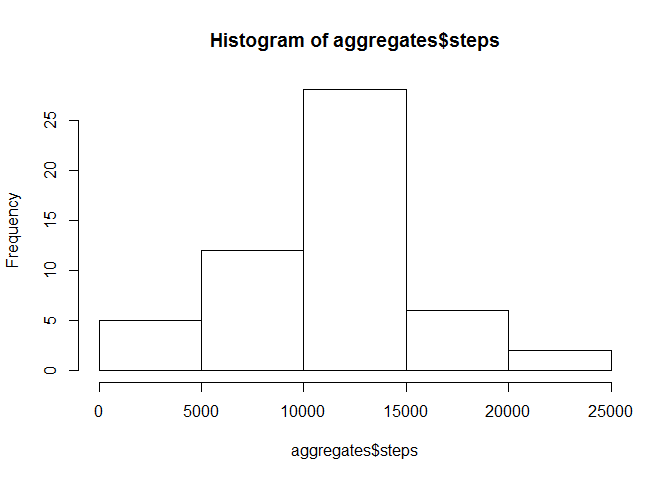
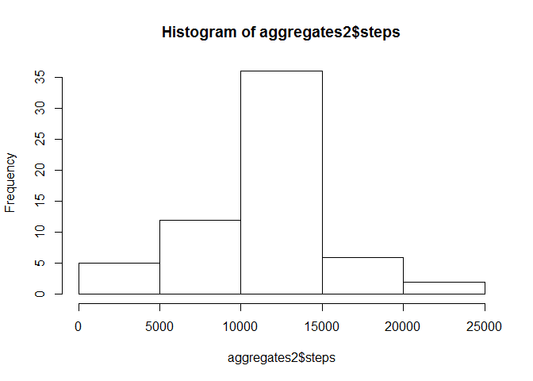
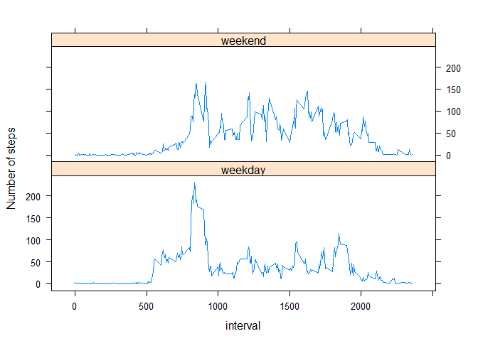

# Reproducible Research: Peer Assessment 1


## Loading and preprocessing the data


```r
temp <- tempfile()
download.file("http://d396qusza40orc.cloudfront.net/repdata%2Fdata%2Factivity.zip",temp)
data <- read.csv(unz(temp, "activity.csv"), header=TRUE)
unlink(temp)

data[,2]=as.Date(data[,2])
```


## What is mean total number of steps taken per day?

Showing histogram


```r
aggregates = aggregate(steps ~ date, data, sum, na.action = na.omit)

hist(aggregates$steps)
```

 

Show mean and median

```r
c(mean(aggregates$steps),median(aggregates$steps))
```

```
## [1] 10766.19 10765.00
```


## What is the average daily activity pattern?

Show time series plot and also the interval with maximum.


```r
#compute first the aggregates
aggregates_5 = aggregate(steps ~ interval, data, mean, na.action = na.omit)

plot(aggregates_5, type="l")
```

 

```r
aggregates_5$interval[which.max(aggregates_5$steps)]
```

```
## [1] 835
```


## Imputing missing values


How many missing values there are


```r
#find index of NAs
index_nas=which(is.na(data$steps))
length(index_nas)
```

```
## [1] 2304
```
Show the histogram

```r
#find the indexes of correspoinding interval means
match_to_interval = match(data$interval[index_nas], aggregates_5$interval)

data2=data
data2$steps[index_nas]=aggregates_5$steps[match_to_interval]


aggregates2 = aggregate(steps ~ date, data2, sum, na.action = na.omit)


hist(aggregates2$steps)
```

 


Show mean and median

```r
c(mean(aggregates2$steps),
median(aggregates2$steps))
```

```
## [1] 10766.19 10766.19
```


## Are there differences in activity patterns between weekdays and weekends?


```r
Sys.setlocale("LC_TIME", "C")
require(lattice)
```
Show panel plot

```r
data2$weekday<-factor(weekdays(data2$date), levels = 
                           c("Monday", "Tuesday", "Wednesday", "Thursday", 
                             "Friday", "Saturday", "Sunday"))

levels(data2$weekday) = c(rep("weekday", 5), rep("weekend",2))

aggregates2_5 <- aggregate(steps ~ interval+weekday, data2, mean)


xyplot(steps~interval|weekday,aggregates2_5, layout=c(1,2), type="l", ylab="Number of steps" )
```

 


